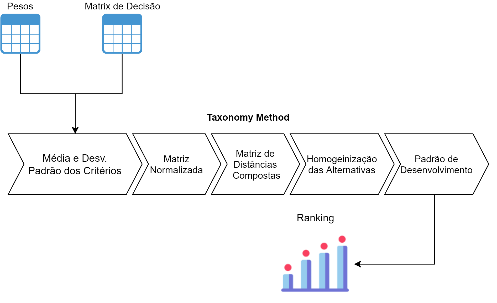

<!-- 
header: 'IME - Instituto Militar de Engenharia'
footer: 'Apresentação: Lorran Santos Rodrigues | Email: lorran.rodr@gmail.com | Professor: Dr. Marcos dos Santos' 
-->
## Taxonomy Method

---
<!-- 
header: ''
footer: '' 
-->

# Objetivo Geral 🎯
---
* Elucidar os principais conceitos relacionados a utilização do Taxonomy Method
* Aplicação prática em um problema proposto
---

# Estrutura da Aula
---

- ## 📝 Contextualização
- ## :abacus: Intuição
- ## 🧠 Mão na Massa
- ## ✅ Conclusão

---

# 📝 Contextualização

---
<!-- footer: '' -->
* Taxonomy Method
     * Introduzido por Adanson em 1763 expandido por um grupo de matemática da polônia em 1950
     * Aplicações:
        - Notas, Classificação, Comparação de atividades dado seu grau de vantagem e utilidade com relação a certos critérios

---
* Características
    * Método compensatório
        - a desvantagem de um valor indesejável em um critério pode ser balanceada com a vantagem de um valor desejável em outro
    * Critérios qualitativos devem ser convertidos em quantitativos
    * Critérios são independentes

---

# Intuição 🧮

---

---

## Mão na Massa 🧠

[Google Colab](https://colab.research.google.com/drive/1XmA268k0YMuDARerL8MCDJknd0Ddcg01?usp=sharing)

---

# Referências

* Alinezhad A., Khalili J. (2019). New methods and applications in multiple attribute decision making (MADM). Springer International Publishing.

*  Jurkowska, B. (2014). The Federal States of Germany—Analysis and measurement of
development using taxonomic methods. Oeconomia Copernicana, 5(3), 49–73.
